# Invariant: A Causality-Bound Execution Kernel for Large Language Models

**Abstract**  
Current AI safety approaches rely on *probabilistic alignment*—training models to "refuse" harmful requests. This approach is brittle; it fails when models hallucinate, are jailbroken, or simply drift. **Invariant** proposes a deterministic alternative: an **Execution Kernel**. By intercepting the token stream at the C++ level, Invariant treats the AI model as an untrusted compute unit, enforcing constraints physically rather than semantically. This system produces a cryptographically signed "Proof of Execution" for every interaction, moving AI accountability from "trust" to "verification".

---

## 1. Introduction: The Black Box Problem

Imagine you hire a brilliant but unpredictable writer. They work so fast you can't read what they write until it's finished. Sometimes they write a masterpiece; sometimes they reveal your company's secrets.

Currently, the industry tries to solve this by giving the writer a stern lecture before they start ("Please be nice"). This is called **Safety Prompting**. It doesn't work because the writer (the AI) can be tricked, confused, or simply ignore the instructions.

**Invariant takes a different approach.** 
It doesn't lecture the writer. Instead, it stands over their shoulder and watches the pen hit the paper. The moment the pen tries to write a forbidden word, Invariant grabs the hand and stops it.

This is not a "wrapper". It is an **Operating System Kernel**. 
Just as Linux stops a program from crashing your RAM, Invariant stops an AI from violating reality.

---

## 2. System Architecture

The system is architected in two planes:
1.  **The Control Plane (Python)**: The high-level manager that defines *what* is allowed (Policies, Context, Identity).
2.  **The Enforcement Plane (C++)**: The low-level machinery that enforces *how* it runs.

### The Flow of Control

```mermaid
graph TD
    User["User Input"] --> Orchestrator{"Invariant Orchestrator"}
    Orchestrator --> Policy["Load Policy Rules"]
    
    subgraph "Untrusted Space"
        Model["AI Model (OpenAI/Mistral)"]
    end
    
    subgraph "Trusted Space (The Kernel)"
        Orchestrator --> Kernel["C++ Execution Boundary"]
        Kernel -->|Intercept| TokenStream["Token Stream"]
        TokenStream -->|Check| Inspector{"Regex/Logic Check"}
        Inspector -->|Violation| Abort["🛑 KILL PROCESS"]
        Inspector -->|Approved| Output["User Output"]
    end
    
    Output --> Receipt["Generate Receipt"]
    Receipt --> Sign["Ed25519 Signature"]
```



### The Mechanism
1.  **Interception**: The kernel wraps the model's output stream. The model does not speak to the user; it speaks to the Kernel.
2.  **Inspection**: Every byte is buffered and checked against the active Policy (compiled C++ regex in this V0 implementation).
3.  **Intervention**: If a violation is detected (e.g., a "Hypothetical" in a Reality-Only policy), the Kernel aborts the stream immediately. The user never sees the completion.
4.  **Attestation**: The system hashes the Input, Policy, Model ID, and Code Version into a `ProofID`. This is cryptographically signed, creating an immutable receipt.

---

## 3. Methodology: 12 Phases of Development

We built Invariant in a strict, layered progression to ensure rigorous isolation of concerns.

**Phase 1: The Boundary**  
Decoupled the Python Control Plane from the C++ Enforcement Plane. Established the `ExecutionGraph` as the single source of truth.

**Phase 2: Causality & Proofs**  
Implemented `invariant.receipt.v0`. Every execution is hashed. If you change one bit of the policy, the Proof ID changes completely.

**Phase 3: The Model Adapter**  
Created a standardized interface for models (Mock, OpenAI, OpenRouter), essentially writing "Drivers" for our OS.

**Phase 4: Policy Engine v0**  
Implemented strict text-matching constraints within the C++ boundary.

**Phase 5: Context Injection**  
Added ability to load external files (`ContextSource`) into the graph, proving *what* data the AI had access to.

**Phase 6: Replayability**  
Built `replay.py`. Since every interaction is a deterministic graph, we can "time-travel" and re-run past inputs against the current kernel to verify logic.

**Phase 7: The Orchestrator**  
Unified all components into a single engine that manages the lifecycle of a request.

**Phase 8: Token-Level Control (The Breakthrough)**  
Moved from checking "text blobs" to checking "streams". The Kernel now inspects execution at the nanosecond/byte level.

**Phase 9: UI & Inspection**  
Built the Streamlit interface to visualize the Kernel's internal state in real-time.

**Phase 10: Active Kernel Logic**  
Implemented "Rolling Buffer" inspection, allowing the system to catch multi-token violations mid-stream.

**Phase 11: Scalable Native Hashing**  
Ported SHA-256 context hashing to C++ to handle GB-scale context files with zero latency.

**Phase 12: Cryptographic Signatures**  
Integrated **Ed25519** signatures. Every receipt is now mathematically attributable to the specific Node Identity.

---

## 4. Case Study: The "Reality-Only" Protocol

To demonstrate the Kernel's capability, we implemented an intentionally restrictive policy: **Reality-Only**.

*   **Constraint**: The AI is strictly forbidden from hypothetical reasoning ("Imagine if", "What if", "Suppose").
*   **Method**: The Kernel scans for speculative grammar (`would be`, `could be`, `imagine`).
*   **Result**: Even if the user begs the AI to write fiction, the Kernel intercepts the output and terminates the response.

*Note: This policy is arbitrary. It exists to prove that the reasoning space of an LLM can be bounded structurally.*

---

## 5. Usage

### Prerequisites
*   Python 3.10+
*   C++ Compiler (Clang/GCC)
*   `pip install poetry` (or standard requirements)

### Running the Kernel
```bash
# 1. Install Dependencies
pip install -r requirements.txt

# 2. Compile C++ Extensions
python3 setup.py build_ext --inplace

# 3. Launch the Interface
streamlit run app.py
```

### Verifying a Receipt
To mathematically prove an interaction happened as claimed:
```bash
python3 replay.py demo_receipt.json
```

---

**License**: MIT  
**Authors**: Jeevan
