# Invariant: A Causality-Bound Execution Kernel for Large Language Models

**Abstract**  
Current AI safety approaches rely on *probabilistic alignment*—training models to "refuse" harmful requests. This approach is brittle; it fails when models hallucinate, are jailbroken, or simply drift. **Invariant** proposes a deterministic alternative: an **Execution Kernel**. By intercepting the token stream at the **native enforcement boundary**, Invariant treats the AI model as an untrusted compute unit, enforcing constraints *architecturally* rather than semantically. This system produces a cryptographically signed "Proof of Execution" for every interaction, moving AI accountability from "trust" to "verification".

---

## 1. Introduction: The Reference Monitor

Invariant is not a wrapper. It is a **Reference Monitor**.

Just as an Operating System Kernel stops a user-space program from crashing memory regardless of the program's intent, Invariant stops an AI model from violating policy regardless of its training.

Current methods act like **Safety Prompting** ("Please be nice").
Invariant acts like a **Kernel Panic** for the model process.

It does not reason about the "truth" of the output. It enforces strict constraints on the execution trace itself. If a forbidden pattern triggers the logic gate, the stream is aborted immediately.

*Invariant is a reference monitor for AI execution, not a judge of AI behavior.*

---

## 2. System Architecture

The system is architected in two planes:
1.  **The Control Plane (Python)**: The high-level manager that defines *what* is allowed (Policies, Context, Identity).
2.  **The Enforcement Plane (C++)**: The low-level machinery that enforces *how* it runs.

### The Flow of Control

```mermaid
graph TD
    User["User Input"] --> Orchestrator{"Invariant Orchestrator"}
    Orchestrator --> Policy["Load Policy Rules"]
    
    subgraph "Untrusted Space"
        Model["AI Model (OpenAI/Mistral)"]
    end
    
    subgraph "Trusted Space (The Kernel)"
        Orchestrator --> Kernel["C++ Execution Boundary"]
        Kernel -->|Intercept| TokenStream["Token Stream"]
        TokenStream -->|Check| Inspector{"Regex/Logic Check"}
        Inspector -->|Violation| Abort["🛑 ABORT STREAM"]
        Inspector -->|Approved| Output["User Output"]
    end
    
    Output --> Receipt["Generate Receipt"]
    Receipt --> Sign["Ed25519 Signature"]
```



### The Mechanism
1.  **Interception**: The kernel wraps the model's output stream. The model does not speak to the user; it speaks to the Kernel.
2.  **Inspection**: Every byte is buffered and checked against the active Policy.
    *   *Note: Invariant does not reason about truth; it enforces constraints on execution traces.*
3.  **Intervention**: If a violation is detected (e.g., a "Hypothetical" in a Reality-Only policy), the Kernel aborts the stream immediately. The user never sees the completion.
4.  **Attestation**: The system hashes the Input, Policy, Model ID, and Code Version into a `ProofID`. This is cryptographically signed, creating an immutable receipt.

---

## 3. Methodology: 12 Phases of Development

We built Invariant in a strict, layered progression. The critical breakthrough occurred at **Phase 8**, moving from post-hoc checks to real-time stream control.

**Phase 1: The Boundary**  
Decoupled the Python Control Plane from the C++ Enforcement Plane. Established the `ExecutionGraph` as the single source of truth.

**Phase 2: Causality & Proofs**  
Implemented `invariant.receipt.v0`. Every execution is hashed. If you change one bit of the policy, the Proof ID changes completely.

**Phase 3: The Model Adapter**  
Created a standardized interface for models (Mock, OpenAI, OpenRouter).

**Phase 4: Policy Engine v0**  
Implemented strict text-matching constraints within the C++ boundary.

**Phase 5: Context Injection**  
Added ability to load external files (`ContextSource`) into the graph, proving *what* data the AI had access to.

**Phase 6: Replayability**  
Built `replay.py`. Since every interaction is a deterministic graph, we can "time-travel" and re-run past inputs against the current kernel to verify logic.

**Phase 7: The Orchestrator**  
Unified all components into a single engine that manages the lifecycle of a request.

**Phase 8: Token-Level Control (The Breakthrough)**  
Moved from checking "text blobs" to checking "streams". The Kernel now inspects execution at the **token level**.

**Phase 9: UI & Inspection**  
Built the Streamlit interface to visualize the Kernel's internal state in real-time.

**Phase 10: Active Kernel Logic**  
Implemented "Rolling Buffer" inspection, allowing the system to catch multi-token violations mid-stream.

**Phase 11: Scalable Native Hashing**  
Ported SHA-256 context hashing to C++ to handle GB-scale context files with zero latency.

**Phase 12: Cryptographic Signatures**  
Integrated **Ed25519** signatures. Every receipt is now mathematically attributable to the specific Node Identity.

---

## 4. Case Study: The "Reality-Only" Protocol

To demonstrate the Kernel's capability, we implemented an intentionally restrictive policy: **Reality-Only**.

*   **Constraint**: The AI is strictly forbidden from hypothetical reasoning ("Imagine if", "What if", "Suppose").
*   **Method**: The Kernel scans for speculative grammar (`would be`, `could be`, `imagine`).
*   **Result**: Even if the user begs the AI to write fiction, the Kernel intercepts the output and terminates the response.

*Note: The policy language is intentionally simplistic regex; the contribution lies in the enforcement point (the kernel), not the expressiveness of the rule. This demonstrates that the reasoning space of an LLM can be bounded structurally.*

### Why Regex? (The "Hello World" of Compliance)
We use regular expressions in this demo because they are **transparent**. You can see exactly *why* a token was blocked. **Do not confuse the configuration with the machinery.** The Invariant Kernel is agnostic. In production, policies can be formal verification specifications or neural classifier decisions.

---

## 5. Non-Goals

Invariant is a specific architectural solution. It is:

*   ❌ **NOT a replacement for model training**: It enforces constraints, it does not teach concepts.
*   ❌ **NOT an alignment technique**: It prevents actions, it does not change the model's values.
*   ❌ **NOT semantic understanding**: The kernel does not "understand" the output; it inspects the trace.
*   ❌ **NOT a moderation framework**: It is an execution boundary, which is lower-level than moderation.

---

## 6. Threat Model (V1)

In this reference implementation, our security assumptions are:

*   **The Model is Untrusted (Adversary)**: The system assumes the AI model is compromised, hallucinating, or actively malicious. The Kernel does not trust the token stream.
*   **The Kernel is Trusted (TCB)**: The C++ Enforcement Boundary is assumed to be running on a secure host. It is the root of trust for the `ProofID`.
*   **The Host is Trusted**: We do not currently model attacks against the host OS (e.g., memory corruption, side-channels).
*   **Scope**: Invariant protects *execution integrity* independent of the model's internal state.

---

## 7. Usage

### Prerequisites
*   Python 3.10+
*   C++ Compiler (Clang/GCC)

### Running the Kernel
```bash
# 1. Install Dependencies
pip install -r requirements.txt

# 2. Compile C++ Extensions
python3 setup.py build_ext --inplace

# 3. Launch the Interface
streamlit run app.py
```

### Verifying a Receipt
To mathematically prove an interaction happened as claimed:
```bash
python3 replay.py demo_receipt.json
```